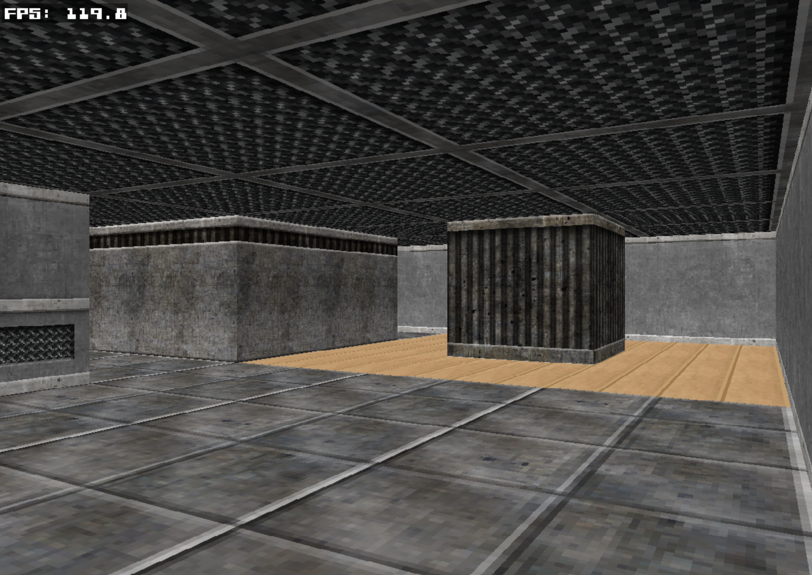

# raycasting



## 💡 Overview
This project is a showcase of the classic Wolfenstein 3D raycasting technique built in C.  
It traces rays through a 2D map to determine wall heights and colors, creating a pseudo-3D view.  
The engine uses a Digital Differential Analyzer (DDA) approach to step through the map grid, detect wall hits, and compute distances.

>[!Note]
>This is a rewrite of my `raycasting-rs` Rust version. You can find the repository [here](https://github.com/adrior11/raycasting-rs/tree/main).

### Inspiration
- [YouTube video by jdh](https://www.youtube.com/watch?v=fSjc8vLMg8c&t)
- [Blogpost by Lode](https://lodev.org/cgtutor/raycasting.html).

## 📦 Prerequisites
- **C Compiler:** GCC or Clang
- **Make:** for building
- **SDL2:** core library, development headers and libraries
- **SDL2_image:** for loading PNG/JPG textures
- **SDL2_ttf:** for rendering fonts

### Installing SDL2

#### macOS
Homebrew example:
```bash
$ brew install sdl2 sdl2_image sdl2_ttf
```

#### Linux
Ubuntu/Debian example:
```bash
$ sudo apt-get update
$ sudo apt-get install libsdl2-dev libsdl2-image-dev libsdl2-ttf-dev
```
Fedora example:
```bash
$ sudo dnf install SDL2-devel SDL2_image-devel SDL2_ttf-devel
```
Arch example:
```bash
$ sudo pacman -S sdl2 sdl2_image sdl2_ttf
```

## 🎨 Assets Setup
Assets like textures (under `textures/...`) and the font file (under `fonts/...`) are git‑ignored due to licensing. You must provide your own:

1. **Textures:** Create a `textures/` directory in the repo root, then add subfolders matching the paths in `tiles.txt`.
Example:
```
raycasting/
├── textures/
│   ├── wall/walltexture1.png
│   ├── floor/floortile1.png
│   └── ...
```

2. **Font:** Place your TTF font file in `fonts/` and update `FONT_PATH` in `main.c` if the name differs.

Failure to supply these assets will cause the engine to print an error and exit on startup.

## 🗂️ Tile Manifest
The `TILE_MANIFEST` (`tiles.txt`) maps hex IDs to texture files and tile types:

```
0x01 textures/wall/walltexture1.png     wall
0x40 textures/floor/floortile1.png      floor
0x60 textures/door/door_lg.png          door
0x70 textures/light/light.png           decor
```

- **Hex ID:** used in `map.txt` to specify which tile to draw.
- **Path:** relative path to the texture file.
- **Type:** one of `wall`, `floor`, `door`, or `decor`.

The engine reads this file at startup and builds a lookup table for fast tile access.

>[!Note]
>Update `MAX_TILE_ID` in `main.c` if your total tile count exceeds 255 (`0xFF`).

## 🗺️ Map Format
`map.txt` begins with the map dimensions, followed by rows of hex IDs:
```
10 10
01 01 01 01 01 01 01 01 01 01
01 40 40 40 40 40 40 40 40 01
01 40 40 60 40 40 70 70 40 01
...
```

- The first line: `<width> <height>`
- Each subsequent value: a two‑digit hex code (from `tiles.txt`).

## 🚀 Building and Running
1. Clone the repository:
``` bash
$ git clone https://github.com/adrior11/raycasting.git
$ cd raycasting
```

2. Build and Run the application:
```bash
$ make
$ ./raycasting
```

Optionally, generate `compile_commands.json` for IDEs and code-indexing tools:
```bash
$ bear -- make
```

## 🎮 Controls
- **W / S**: Move forward / backward
- **A / D**: Strafe left / right
- **← / →**: Rotate camera
- **ESC**: Quit the application

## License
This project is available under the MIT License.
